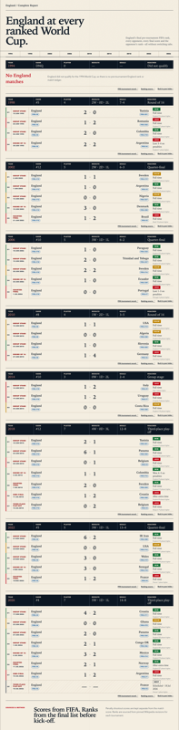
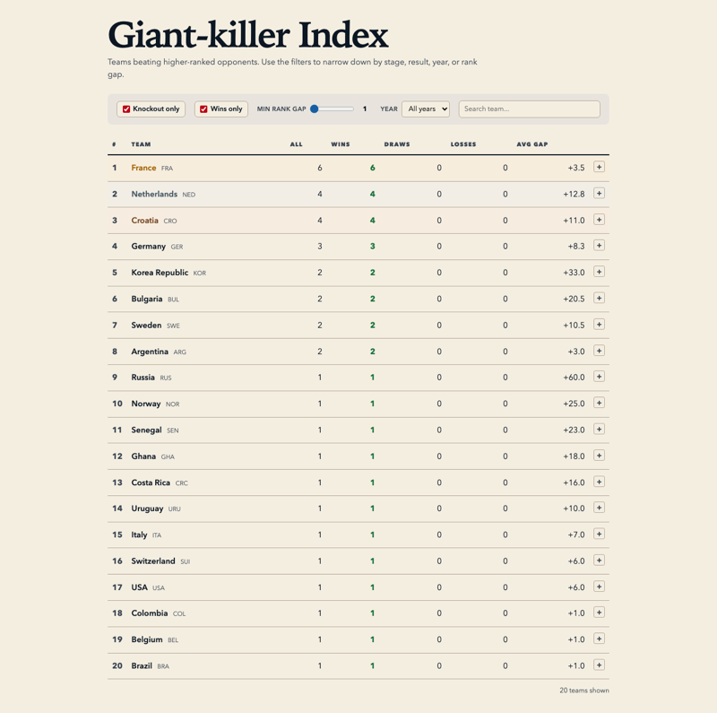

# World Cup pre-tournament FIFA rankings

Every team's FIFA rank before each men's World Cup from 1994 (when the ranking began) through 2026, plus a complete match-by-match record for every team that qualified.

The data powers two kinds of reports — an interactive dashboard per team and a continuous print-friendly page — and an SQLite database for querying.

## Quick start

```sh
# Build rankings from pinned Wikipedia revisions
./build_world_cup_rankings.py

# Scrape every match from group and knockout articles
./build_all_world_cup_matches.py

# Build the SQLite database
./build_database.py

# Generate all reports
./generate_all_reports.py

# Open the team index
open docs/index.html
```





All scripts use `uv` for inline dependency management — just run them.

## Data files

| File | Rows | Description |
|------|------|-------------|
| `data/world_cup_rankings.csv` | 296 | Every team at every World Cup: FIFA code, rank, confederation, source |
| `data/world_cup_ranking_sources.csv` | 9 | One source record per tournament |
| `data/*_world_cup_matches.csv` | ~1,100 | Per-team match ledger with both teams' pre-tournament ranks |

## Reports

All output in `reports/`:

- **`index.html`** — searchable grid linking to every team's continuous report and interactive dashboard
- **`*-world-cups-all.html`** — 77 continuous, print-friendly reports (no JavaScript)
- **`*-world-cup-tabs.html`** — interactive dashboards with year tabs, match ledger, and ranking history chart for every team with match data
- **`effectiveness.html`** — the Giant-killer Index: teams ranked by wins against higher-ranked opponents, with live filters

## Database

```sh
./build_database.py
sqlite3 worldcup.db
```

Two tables with foreign keys:

- `rankings` — `(world_cup_year, fifa_code)` primary key, plus team, confederation, rank, source
- `matches` — every match with `team_code`, `opponent_code`, scores, shootout scores, stage, result, status

Example queries:

```sql
-- Most matches played
SELECT team_code, COUNT(*) FROM matches GROUP BY 1 ORDER BY 2 DESC LIMIT 10;

-- Best record against higher-ranked opponents
SELECT team_code,
       SUM(CASE WHEN result='win' AND team_rank > opponent_rank THEN 1 ELSE 0 END) AS upset_wins,
       SUM(CASE WHEN result='win' AND team_rank > opponent_rank AND stage NOT LIKE 'Group%' THEN 1 ELSE 0 END) AS ko_upsets
FROM matches GROUP BY 1 ORDER BY 3 DESC LIMIT 10;
```

## Dashboard (dev server)

The interactive dashboard also runs as a live dev server reading CSVs at runtime:

```sh
./serve_dashboard.py       # → http://localhost:8000
```

## Build pipeline

```
Wikipedia API (pinned revisions)
    │
    ├── build_world_cup_rankings.py  →  data/world_cup_rankings.csv
    │                                      data/world_cup_ranking_sources.csv
    │
    └── build_all_world_cup_matches.py  →  data/*_world_cup_matches.csv
         (scrapes group + knockout articles for every tournament)
              │
              ├── build_database.py  →  worldcup.db
              │
              └── generate_all_reports.py  →  reports/*.html
                   (continuous + interactive dashboards + index)
```

## Sources & acknowledgements

**Wikipedia** — Team rankings are extracted from pinned revisions of tournament pages on Wikipedia. Match results are parsed from group and knockout stage articles. Wikipedia content is available under the [Creative Commons Attribution-ShareAlike 4.0 International](https://en.wikipedia.org/wiki/Wikipedia:Text_of_the_Creative_Commons_Attribution-ShareAlike_4.0_International_License) (CC BY-SA 4.0) license.

**FIFA** — All pre-tournament rankings originate from FIFA's official [Men's World Ranking](https://www.fifa.com/fifa-world-ranking/men) publications. Match scores are sourced from FIFA's tournament records. FIFA data is © FIFA.

**2026 data** — Current tournament data is sourced from `2026_FIFA_World_Cup_round_of_32` and `2026_FIFA_World_Cup_knockout_stage` pages as the tournament progresses.

Penalty shootout scores are kept separate from the match score. Scheduled matches without a result are marked as such.

## License

The code in this repository is licensed under the MIT License — see [LICENSE](LICENSE). The data files in `data/` are derived from Wikipedia (CC BY-SA 4.0) and FIFA sources.
